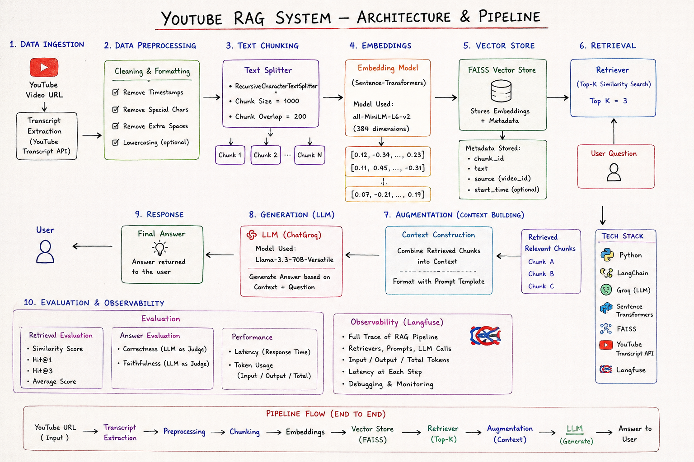

# YouTube RAG

Welcome to **YouTube RAG**, a production-ready Retrieval-Augmented Generation (RAG) system that transforms any YouTube video into an interactive, conversational knowledge base.



## Overview

This application allows you to ingest transcripts from YouTube videos and chat with them. It leverages state-of-the-art asynchronous APIs, advanced memory management for conversational RAG, and high-quality monitoring. 

Built with scalability and quality in mind, YouTube RAG serves as an excellent demonstration of building intelligent applications that interact dynamically with users and video content.

## Features

- **Conversational RAG**: Supports multi-turn conversations, maintaining chat history to answer follow-up questions contextually.
- **Asynchronous APIs**: Powered by a production-level, fully asynchronous FastAPI backend.
- **Premium UI**: A high-quality Streamlit frontend ("Video Intelligence Desk") designed with dark mode, rich aesthetics, and built-in chat history.
- **Observability**: Deeply integrated with **Langfuse** for evaluation, tracing, and monitoring of all LLM and chain executions.
- **Fast Search**: Uses FAISS for efficient, local semantic search over video transcripts.

## Technology Stack

- **Backend**: FastAPI (Async), Uvicorn
- **AI / LLM Framework**: LangChain, Groq API (Llama 3)
- **Vector Store**: FAISS
- **Observability**: Langfuse
- **Frontend**: Streamlit

## Setup & Installation

### 1. Clone the repository
```bash
git clone <your-repo-url>
cd youtube_rag
```

### 2. Create a Virtual Environment
```bash
python -m venv .venv
source .venv/bin/activate  # On Windows: .venv\Scripts\activate
```

### 3. Install Dependencies
```bash
pip install -r requirements.txt
```

### 4. Environment Variables
Create a `.env` file in the root directory and add the following keys:
```env
# Groq API for LLM
GROQ_API_KEY="your-groq-api-key"

# HuggingFace for Embeddings
HUGGINGFACE_API_KEY="your-huggingface-api-key"

# Langfuse for Observability
LANGFUSE_SECRET_KEY="your-langfuse-secret-key"
LANGFUSE_PUBLIC_KEY="your-langfuse-public-key"
LANGFUSE_HOST="https://cloud.langfuse.com"
```

## Running the Application

### Start the FastAPI Backend
```bash
uvicorn app.main:app --reload
```
The backend will be available at `http://127.0.0.1:8000`. You can explore the API documentation at `http://127.0.0.1:8000/docs`.

### Start the Premium Frontend
Open a new terminal window (with the virtual environment activated) and run:
```bash
streamlit run app/frontend.py
```
This will launch the conversational "Video Intelligence Desk" in your browser.

## Evaluation & Observability

This project heavily emphasizes evaluation and monitoring. By using **Langfuse**, every retrieval step, generation step, and chain execution is traced. This provides immense value for:
- Tracking retrieval metrics (e.g., Hit@K, MRR) for different semantic search configurations (FAISS vs. Cross-Encoders).
- Monitoring generation latency, token usage, and overall system health.
- Debugging individual conversations and maintaining high-quality answers.

You can view your traces in the [Langfuse Dashboard](https://cloud.langfuse.com).