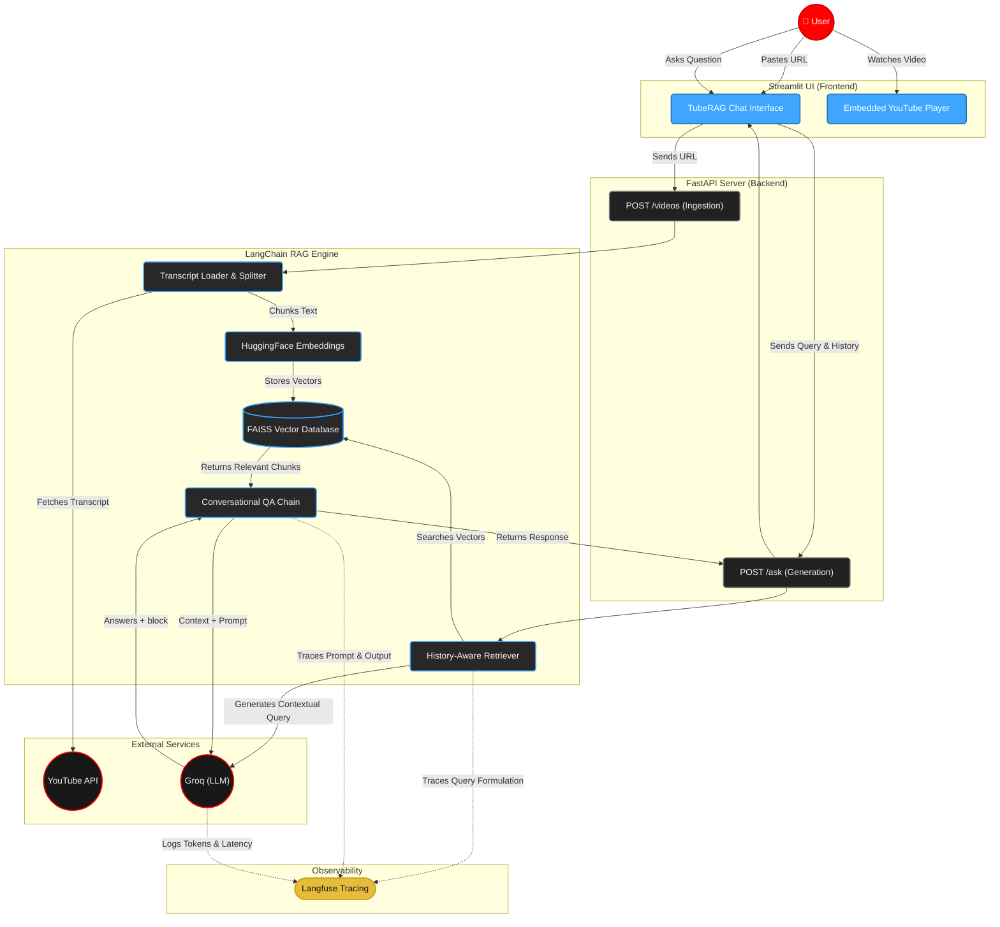

# TubeRAG (v1)

Welcome to **TubeRAG**, a production-ready Retrieval-Augmented Generation (RAG) system that transforms any YouTube video into an interactive, ChatGPT-style conversational knowledge base.

## System Architecture


## Overview

TubeRAG is built to demonstrate how to engineer a high-scale, asynchronous RAG application from the ground up. It seamlessly ingests YouTube video transcripts and allows users to chat with the content. Version 1 of this project solidifies the core conversational logic, robust backend architecture, advanced UI styling, and deep observability.

## Key Features in V1

- **YouTube-Inspired UI**: A sleek, dark-themed interface built on Streamlit featuring a native, clean chat aesthetic without clunky borders.
- **Live Video Embedding**: When you load a video, the YouTube player is embedded directly into the sidebar so you can watch and chat simultaneously.
- **Conversational Memory**: Utilizes LangChain's `history_aware_retriever` to remember previous turns in the conversation, allowing for natural, follow-up questions.
- **Reasoning Model Support**: Built-in support for reasoning models (like `qwen/qwen3.6-27b`). The `<think>` reasoning tags are automatically parsed out of the chat and tucked away into a clean, collapsible "Thinking Process" accordion.
- **Asynchronous FastAPI Backend**: All endpoints (`/ask`, `/videos`) are strictly typed with Pydantic and fully asynchronous to handle concurrency at scale.
- **Robust Observability**: Fully integrated with **Langfuse**. Every retrieval step, generated token, and prompt execution is captured and traced for easy evaluation (LLM-as-a-judge) in the Langfuse dashboard.

## Technology Stack

- **Backend**: FastAPI (Async), Uvicorn, Pydantic
- **AI / LLM Framework**: LangChain, Groq API
- **Vector Store**: FAISS
- **Observability**: Langfuse
- **Frontend**: Streamlit

## Setup & Installation

### 1. Clone the repository
```bash
git clone <your-repo-url>
cd youtube_rag
```

### 2. Create a Virtual Environment
```bash
python -m venv .venv
# On Windows:
.venv\Scripts\activate
# On Mac/Linux:
source .venv/bin/activate
```

### 3. Install Dependencies
```bash
pip install -r requirements.txt
```
*(Note: V1 includes strict dependency resolution for LangChain Core v1.5.x and Numpy <2.0 to ensure stability across Scipy and Faiss).*

### 4. Environment Variables
Create a `.env` file in the root directory and add the following keys:
```env
# Groq API for LLM
GROQ_API_KEY="your-groq-api-key"

# HuggingFace for Embeddings
HUGGINGFACE_API_KEY="your-huggingface-api-key"

# Langfuse for Observability
LANGFUSE_SECRET_KEY="your-langfuse-secret-key"
LANGFUSE_PUBLIC_KEY="your-langfuse-public-key"
LANGFUSE_HOST="https://cloud.langfuse.com"
```

## Running the Application

### Start the FastAPI Backend
```bash
uvicorn app.main:app --reload
```
The backend will be available at `http://127.0.0.1:8000`. You can explore the API documentation at `http://127.0.0.1:8000/docs`.

### Start the TubeRAG Frontend
Open a new terminal window (with the virtual environment activated) and run:
```bash
streamlit run app/frontend.py
```
This will launch the conversational interface in your browser.

## Roadmap to V2
While V1 establishes a premium baseline for single-video analysis, V2 will focus on high-level multi-document architectures, advanced agentic orchestration, and deploying for widespread production access. Stay tuned!